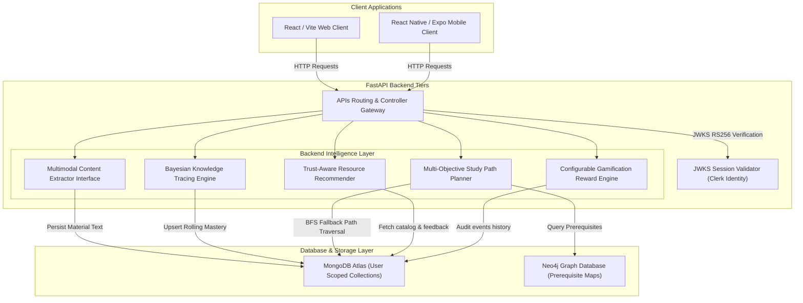

# MK-Path System Architecture

The following block diagram outlines the component tiers, data flow, and active service integrations:

---

## 1. Modular Services Integration
*   **Ingestion Extractor Interface**: Contains `PDFExtractor` (PyMuPDF), `TextExtractor`, `OCRExtractor` (OCR scanned text), `AudioExtractor` (transcribing logs), and `VideoExtractor`.
*   **Knowledge Tracing Service**: Executes dynamic BKT updates adjusting slip and guess parameters on quiz submissions, operating concurrently in Shadow Mode.
*   **Graph Intelligence Service**: Performs Neo4j Bolt graph traversal, with offline-ready local Graph BFS algorithm backups.
*   **Study Planner Service**: Compares heuristic weights against Graph-Aware nodes and tabular Q-learning RL policy runs.
*   **Recommender Service**: Blends curated authority trust, average community rating feedback, age freshness, difficulty fits, and completion penalties.
*   **Gamification Service**: Centralizes XP constants and audits learner event logs.
